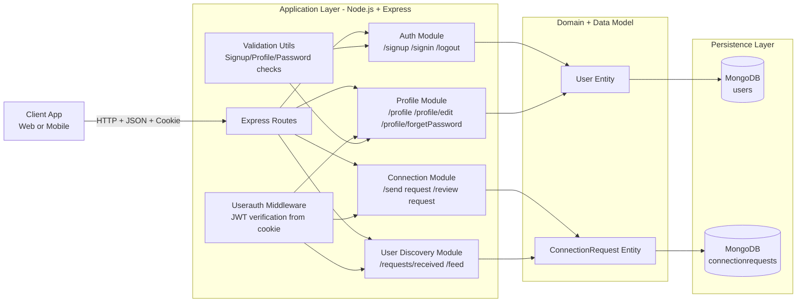
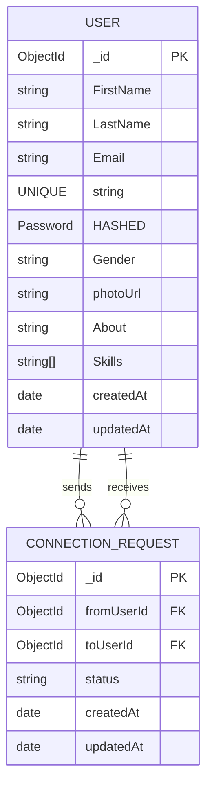

# Socialize Backend - Interview System Design Pack

## 1) Clean Architecture Diagram



### Architecture Notes

- Style: modular monolith with clear route and module separation.
- Authentication: JWT token stored in cookie and verified by middleware.
- Data access: Mongoose models for User and ConnectionRequest collections.
- Current gap: business logic is still route-centric; service layer can be added later.

## 2) ER Diagram



### Entity Rules

- User.Email is unique.
- ConnectionRequest status allowed values: interested, ignored, accepted, rejected.
- fromUserId and toUserId cannot be same user.
- Duplicate request pairs are blocked in app logic across both directions.

## 3) API Table (Method, Endpoint, Auth, Request, Response)

| Method | Endpoint                            | Auth Required      | Request (Body/Params)                                                | Success Response                                    | Notes                                                              |
| ------ | ----------------------------------- | ------------------ | -------------------------------------------------------------------- | --------------------------------------------------- | ------------------------------------------------------------------ |
| POST   | /signup                             | No                 | Body: FirstName, LastName, Email, Password                           | 200 text: User Added Successfully !!!               | Validates name, email, strong password, hashes password            |
| POST   | /signin                             | No                 | Body: Email, Password                                                | 200 text: Login Successfull ! and sets token cookie | Invalid credentials returns 400                                    |
| POST   | /logout                             | No                 | None                                                                 | 200 JSON with message                               | Clears token cookie                                                |
| GET    | /profile                            | Yes (cookie token) | None                                                                 | User object                                         | Returns authenticated user from middleware                         |
| PATCH  | /profile/edit                       | Yes                | Body: subset of FirstName, LastName, Gender, photoUrl, About, Skills | JSON with message and updated data                  | Saves profile after applying allowed fields                        |
| PATCH  | /profile/forgetPassword             | Yes                | Body: currentPassword, newPassword                                   | 200 text: Password Changed                          | Validates allowed keys, compares current password, writes new hash |
| POST   | /requests/:toUserId/send/:status    | Yes                | Params: toUserId, status                                             | JSON message confirming status                      | status must be interested or ignored                               |
| POST   | /requests/:requestId/review/:status | Yes                | Params: requestId, status                                            | 200 JSON with updated request                       | status must be accepted or rejected; only recipient can review     |
| GET    | /user/requests/received             | Yes                | None                                                                 | 200 JSON with pending interested requests           | Populates sender basic profile fields                              |
| GET    | /user/connections                   | Yes                | None                                                                 | Not fully implemented yet                           | Scaffold exists                                                    |
| GET    | /user                               | No                 | Body: email                                                          | Array of matching users                             | Legacy endpoint in app.js                                          |
| GET    | /feed                               | No                 | None                                                                 | Array of users                                      | Returns all users                                                  |
| GET    | /fid                                | No                 | Body: \_idProvided                                                   | User object                                         | Fetch by id endpoint in app.js                                     |
| DELETE | /user                               | No                 | Body: id                                                             | text: User Deleted !!                               | Deletes by id                                                      |
| PATCH  | /user/:id                           | No                 | Params: id, Body: photoUrl/About/Gender/Age                          | 200 JSON message                                    | Legacy endpoint with field whitelist                               |

### Standardized Request and Response Shape (Recommended)

#### Request example

```json
{
  "FirstName": "Alex",
  "LastName": "Lee",
  "Email": "alex@example.com",
  "Password": "Strong@123"
}
```

#### Response example

```json
{
  "success": true,
  "message": "Operation successful",
  "data": {}
}
```

#### Error example

```json
{
  "success": false,
  "message": "Validation failed",
  "errorCode": "VALIDATION_ERROR"
}
```

## 4) 10 Likely Interviewer Questions With Strong Answers

1. Why did you choose JWT in cookies instead of sessions?

- JWT gives stateless authentication, which supports horizontal scaling more easily.
- Cookie transport is convenient for browsers; middleware validates token on protected routes.
- For production, set HttpOnly, Secure, and SameSite flags to reduce XSS and CSRF risk.

2. How do you prevent duplicate connection requests between two users?

- Before creating a request, the system checks both directions: A to B and B to A.
- If either exists, it rejects the new request.
- A DB unique strategy can be added later by storing normalized pair keys.

3. What are your core entities and why only these two?

- User handles identity, profile, and credentials.
- ConnectionRequest models relationship intent and state transitions.
- This keeps MVP focused; chat, notifications, and blocking can be separate future entities.

4. How does your request lifecycle work?

- Sender creates interested or ignored status for a target user.
- Recipient can review an interested request and change it to accepted or rejected.
- This gives a clear state machine and supports auditability via timestamps.

5. How do you secure passwords and login flow?

- Passwords are never stored in plain text; bcrypt hashes are stored.
- On signin, password is compared against hash.
- Only selected queries expose password field intentionally.

6. What are major non-functional requirements for this project?

- Security: auth middleware, hashing, validation.
- Scalability: stateless API and possible horizontal scale.
- Performance: indexes and pagination for large feeds.
- Maintainability: route modularization and future service layer extraction.

7. What would you improve first for production readiness?

- Add centralized error middleware and consistent JSON responses.
- Add rate limiting and request logging.
- Add pagination for feed and requests.
- Add role-based access checks for sensitive endpoints.

8. How do you model one-to-many and many-to-many relationships in MongoDB here?

- User to ConnectionRequest is one-to-many on sender and recipient sides.
- Many-to-many social graph emerges via ConnectionRequest documents.
- Mongoose populate is used for sender profile details in received requests endpoint.

9. How do you handle schema validation and business validation?

- Schema-level validation is in Mongoose (email, enums, required fields).
- Business validation is in utility functions and route-level checks.
- Example: allowed profile fields and allowed request statuses.

10. What is one tradeoff in your current architecture?

- Business logic is still inside routes, which can become hard to test at scale.
- Tradeoff was faster MVP delivery.
- Next step is introducing service and repository layers to improve testability and separation of concerns.

## 5) Quick Interview Closing Statement

This backend is designed as a practical MVP with secure authentication, clear domain modeling, and modular route-level decomposition. It demonstrates strong fundamentals in API design, data modeling, and request lifecycle control, while also leaving a clear roadmap for production hardening with pagination, observability, and service-layer refactoring.
